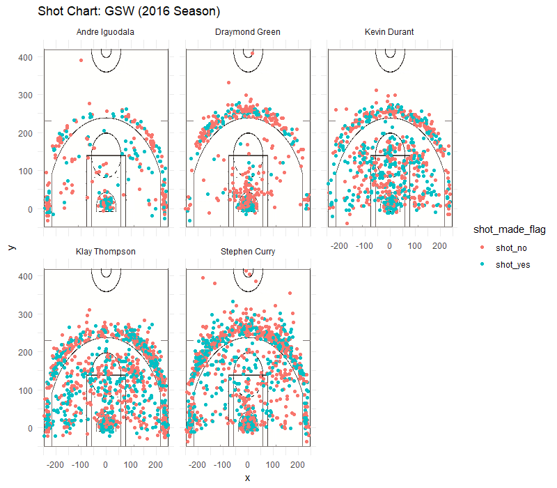
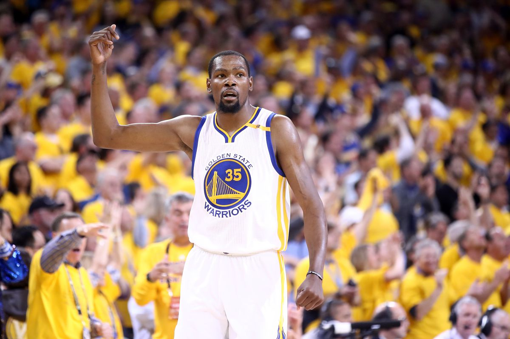

Workout 1
================
Carol Lee

Golden State Warriors Shooting Statistics
-----------------------------------------

Strength in numbers. This iconic slogan of the Golden State Warriors proves itself true through the historic streaks and achievements of the team. In recent years, the Warriors have won multiple championships: 2015, 2017, and 2018. Though hitting a blunder in the 2016 Finals, losing in Game 7 to the Cleveland Cavaliers, the data is undeniable: the Warriors have some of the highest stats in the NBA. What is the secret to the Warriors' strong scores? Who contributes most to these numbers? What is the secret to high scores - does it lie in shooting more two-pointers or more three-pointers? To answer these questions, we will break down shooting statistics and take a deeper look into the points that build up this strength in numbers.

### Background and Data

The Golden State Warriors are an American professional basketball team led by Steve Kerr and based in Oakland, California. They compete in the NBA, the National Basketball Association. Today, we are going to look at the data of five key members of the Warriors: Andre Iguodala, Draymond Green, Kevin Durant, Klay Thompson, and Stephen Curry. Here is a quick breakdown of the journey we are taking to reach our answers:

1.  Visual representation of shots missed and scored
2.  Individual stats of percentage of shots made
3.  Comparison between players of percentage of shots made (2 pt, 3 pt, and overall)
4.  Comparison between players of percentage of points made out of the point value of all attempted shots
5.  Analysis of who and what strategy contribute the most to the overall score
6.  Summary

From the chart, we get a visual representation of each of these five team member's shots: those scored and those missed. We can also see roughly where each shot was taken from. Just from looking at these charts, it seems that Kevin Durant, Klay Thompson, and Stephen Curry have similar charts, while Andre Iguodala and Draymond Green are more of the outliers. Though similar, upon closer examination we can see who has greater strength in shooting 2-pointers and who has greater strength in 3-pointers. To get a better sense of these numbers and to ease comparison, we will take a look at the exact data and calculate percentages of shot points. First, let's get a brief introduction to each of these five players and their stats, then compare and analyze as a group.

#### Andre Iguodala

Andre Iguodala, the small forward and shooting guard of the team, was an NBA All-Star in 2012. Let's take a look at his shots in 2016.

From the chart, we get a visual representation of the shots Iguodala has taken and the ones which he scored and missed. Iguodala attempted the least amount of shots, but he has a fair amount of shots made. From calculating the exact percentages, the percentage of two-pointers he made is approximately 63.81%, while the percentage of three-pointers he made is approximately 36.02%.

#### Draymond Green

Let's take a look at Draymond Green next. Green plays primarily in the power forward position. He is a three-time NBA champion as well as three-time NBA All-Star.

From looking at the chart, Green seems to have a larger number of red points than the other four players, meaning he has missed more shots. Is this true? Looking at the data, Green has made approximately 49.42% of two-pointers and approximately 31.90% of three-pointers.

#### Kevin Durant

Next, we examine the scores of Kevin Durant, an All-Star forward. He is a two-time champion and two-time NBA Most Valuable Player.

His shots are very evenly spread out, as we can see from the chart. Regarding his exact scores, he has made 60.65% of his two-pointers and 38.60% of his three-pointers.

#### Klay Thompson

Next up, we have Klay Thompson, a shooting guard. Thompson is credited as one of the greatest shooters in NBA. We will see if his 2016 stats align with that! He is a five-time All-Star and a three-time NBA champion.

From the visual, his shots are fairly scattered and spread. He seems to have a good amount of both 2-pointers and 3-pointers made. His stats are 51.41% of two-pointers made, and 42.41% of three-pointers made.

#### Stephen Curry

Alright, last but not least, we have Stephen Curry, point guard. Curry has some impressive titles, being a six-time NBA All-Star, two-time NBA Most Valuable Player, and three-time champion.

From the visual, we see that Curry attempts 3-pointers from far away that others do not, but misses them. However, he has a large amount of 3-pointers made. Curry has made approximately 54.00% of his attempted two-pointers, and approximately 40.76% of his attempted three-pointers.

### Discussion

Now, let's pull all the data together to compare the players, as well as analyze how their mutual effort pushes them to the top. First, a look at two-point shots made by the five players. This is a summary of the stats we have previously talked about.

    ## # A tibble: 5 x 4
    ##   name           total  made perc_made
    ##   <fct>          <int> <int>     <dbl>
    ## 1 Andre Iguodala   210   134     0.638
    ## 2 Kevin Durant     643   390     0.607
    ## 3 Stephen Curry    563   304     0.540
    ## 4 Klay Thompson    640   329     0.514
    ## 5 Draymond Green   346   171     0.494

All the players make almost half of their attempted two-pointers or more. Iguodala comes in as the top two-point scorer, at almost 63.81% of shots made, while Durant follows with 60.65%. Now, let's rank the players for three-pointers.

    ## # A tibble: 5 x 4
    ##   name           total  made perc_made
    ##   <fct>          <int> <int>     <dbl>
    ## 1 Klay Thompson    580   246     0.424
    ## 2 Stephen Curry    687   280     0.408
    ## 3 Kevin Durant     272   105     0.386
    ## 4 Andre Iguodala   161    58     0.360
    ## 5 Draymond Green   232    74     0.319

The percentages are smaller than for two-pointers, as expected. Here, we see a pretty different ordering of names. Thompson comes in as the highest 3-point scorer, at 42.41%, while Curry follows closely with 40.76%. The rest are also relatively close. The Warriors mostly vary in strength of 2 point scoring versus 3 pt scoring, with exception of Green who comes in last for both. Now, who makes the highest number of shots made overall? Let's take a look at the stats of combined two-pointers and three-pointers: the overall shots data.

    ## # A tibble: 5 x 4
    ##   name           total  made perc_made
    ##   <fct>          <int> <int>     <dbl>
    ## 1 Kevin Durant     915   495     0.541
    ## 2 Andre Iguodala   371   192     0.518
    ## 3 Klay Thompson   1220   575     0.471
    ## 4 Stephen Curry   1250   584     0.467
    ## 5 Draymond Green   578   245     0.424

Though not the top two-point scorer nor the top three-point scorer, Durant pulls in as the top overall scorer, with almost 54.1% of shots made! In fact, he is only the third highest three-point scorer. We also see here that even though Curry makes a good amount of three-pointers, he ranks second to last overall. It seems that for these players, the two-pointers are more effective in raising the overall number of shots made. However, since three-pointers are weighted more in terms of number of points earned, we will have to look at the percentage of points made out of the total number of points attempted to come to a better conclusion about the most effective shooting strategy for the Warriors.

Here is a table of the total number of points each of these five members scored for the team in 2016, as well as a couple of graphs to help with interpreting the data visually.

    ## # A tibble: 5 x 4
    ##   name           total_attempted_points total_points perc_points_made
    ##   <fct>                           <dbl>        <dbl>            <dbl>
    ## 1 Kevin Durant                     2102         1095            0.521
    ## 2 Andre Iguodala                    903          442            0.489
    ## 3 Klay Thompson                    3020         1396            0.462
    ## 4 Stephen Curry                    3187         1448            0.454
    ## 5 Draymond Green                   1388          564            0.406

    ##             name total made perc_made total_attempted_points total_points
    ## 1   Kevin Durant   915  495 0.5409836                   2102         1095
    ## 2 Andre Iguodala   371  192 0.5175202                    903          442
    ## 3  Klay Thompson  1220  575 0.4713115                   3020         1396
    ## 4  Stephen Curry  1250  584 0.4672000                   3187         1448
    ## 5 Draymond Green   578  245 0.4238754                   1388          564
    ##   perc_points_made
    ## 1        0.5209324
    ## 2        0.4894795
    ## 3        0.4622517
    ## 4        0.4543458
    ## 5        0.4063401

Curry and Thompson have the highest number of points scored from all shots made, mostly due to their high number of attempted shots.

For the percentage of points made out of the point value of all attempted shots, the ranking remains the same as for the analysis with shots made, suggesting to us that overall, the contribution of each extra point from each three-pointer is not effective enough to overtake the score of a less accurate three-pointer thrower. We see that because Thompson and Curry scored a significant amount of three-pointers over the rest, the difference in the percentage of shots made and the percentage of points scored is not as much as for this same difference in the other three players. Their accuracy in scoring three-pointers gives them a boost in increasing their percentage of points made out of those attempted, but it is not significant enough to push them to a higher rank. Therefore, the players who scored the most points out of the points they attempt remain the same as those who made the highest number of shots. This goes to Durant and Iguodala, who have high two-pointer shooting accuracy. So, the bulk of the points the Warriors score is due to their strength in making two-pointers. Because the players' shooting accuracy for two-pointers is significantly higher as compared to their accuracy for three-pointers, overall, shooting two-pointers is what contributes most to their scores. Of course, the three-pointers contribute to a good chunk of their overall score, but looking at how much a two-pointer benefits the Warriors versus a three-pointer while taking into account each player's accuracy, the two-pointers are the most important and make the most difference in how well they score.

### Conclusion and Summary

Now that we have taken a look at the data and drawn some useful graphs and visuals, let's take a moment to digest what we have discovered. Looking at two-pointers, we found that Andre Iguodala had the highest percentage of scored shots. For three-pointers, Thompson held the lead. However, overall, Durant scored the highest percentage of shots, followed by Iguodala. When we take into account the percentage of points each player contributed out of the total point value of their attempted shots, we realize that the ranking does not change, as the extra point of the three-pointers do not contribute that significant of an amount. This is due to the players' stats in shooting. Because their two-point shooting is so much greater than their three-point shooting, shooting two-pointers contributes most to their overall score. Of course, many other factors and players should be taken into account in the operation and strategy of the Warriors. However, this bit of data and analysis does give us some interesting and valuable insight into their scores and numbers. This is how the Warriors hold true to their "Strength in Numbers!"
